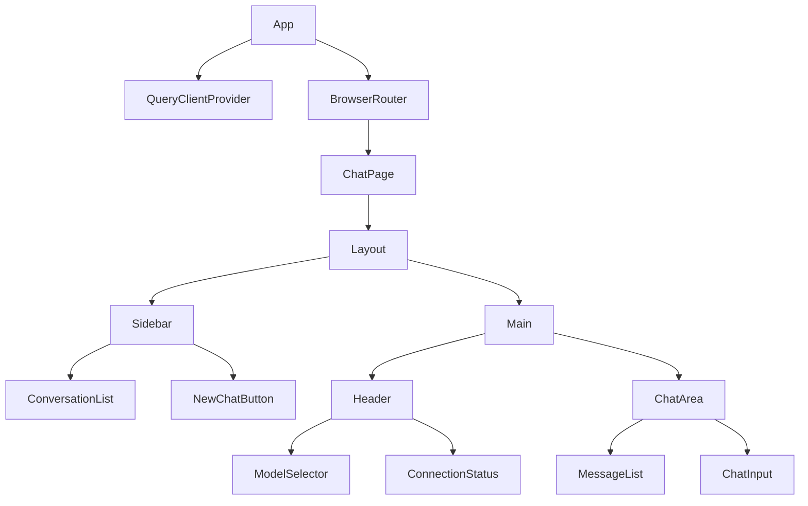
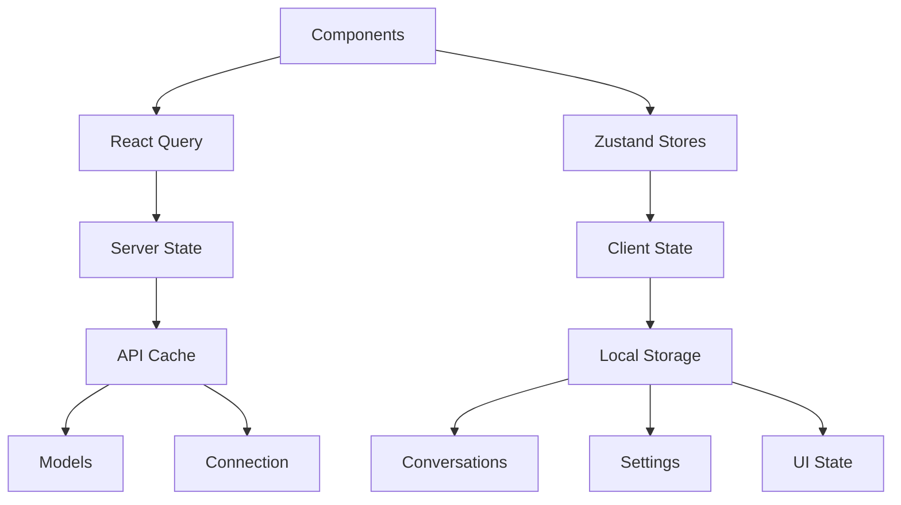
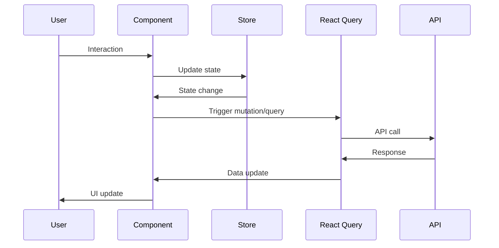

# Ollama Chat App - New Architecture Design

## Overview

This document outlines the redesigned architecture for recreating the Ollama chat app from scratch using modern React patterns, TypeScript, and shadcn/ui components. The new design maintains all existing functionality while incorporating improvements in state management, performance, and code organization.

## 1. Overall Application Structure and Folder Organization

```
src/
├── components/           # Shared UI components (shadcn/ui primitives)
│   ├── ui/              # shadcn/ui components
│   └── common/          # App-specific shared components
├── features/            # Feature-based organization
│   ├── chat/
│   │   ├── components/  # Chat-specific components
│   │   ├── hooks/       # Chat-related hooks
│   │   └── types.ts     # Chat-specific types
│   ├── conversations/
│   │   ├── components/
│   │   ├── hooks/
│   │   └── types.ts
│   ├── models/
│   │   ├── components/
│   │   ├── hooks/
│   │   └── types.ts
│   └── settings/
│       ├── components/
│       ├── hooks/
│       └── types.ts
├── lib/                 # Utilities and API clients
│   ├── api/             # API client functions
│   ├── storage.ts       # Local storage utilities
│   └── utils.ts         # General utilities
├── stores/              # Zustand stores
│   ├── conversations.ts
│   ├── settings.ts
│   └── ui.ts
├── hooks/               # Shared custom hooks
├── types/               # Global type definitions
├── pages/               # Route components
├── App.tsx
├── main.tsx
└── index.css
```

## 2. Component Hierarchy and Data Flow

### Component Hierarchy

```
App
├── QueryClientProvider
├── TooltipProvider
├── Toaster
├── BrowserRouter
│   └── Routes
│       ├── Route ("/") -> ChatPage
│       └── Route ("*") -> NotFound
└── ChatPage
    ├── Layout
    │   ├── Sidebar
    │   │   ├── Logo
    │   │   ├── ConversationList
    │   │   │   ├── NewChatButton
    │   │   │   └── ConversationItem[]
    │   │   └── Footer
    │   └── Main
    │       ├── Header
    │       │   ├── ModelSelector
    │       │   ├── ConnectionStatus
    │       │   ├── PullModelDialog
    │       │   └── SettingsDialog
    │       └── ChatArea
    │           ├── MessageList
    │           │   └── ChatMessage[]
    │           └── ChatInput
    │               ├── FileUpload
    │               └── SendButton
    └── ConnectionErrorOverlay
```

### Data Flow

- **Server State**: Managed by React Query (models, connection status, API responses)
- **Client State**: Managed by Zustand stores (conversations, settings, UI state)
- **Component Communication**: Props for simple cases, stores for complex state sharing
- **Events**: Components dispatch actions to stores or trigger React Query mutations

## 3. State Management Strategy

### React Query (Server State)
- Models list and metadata
- Connection status
- API error states and retry logic
- Caching and background refetching

### Zustand Stores (Client State)

#### Conversations Store
```typescript
interface ConversationsState {
  conversations: Conversation[];
  activeId: string | null;
  actions: {
    createConversation: (model: string) => void;
    deleteConversation: (id: string) => void;
    updateConversation: (id: string, updates: Partial<Conversation>) => void;
    setActiveConversation: (id: string | null) => void;
  };
}
```

#### Settings Store
```typescript
interface SettingsState {
  settings: OllamaSettings;
  actions: {
    updateSettings: (settings: OllamaSettings) => void;
  };
}
```

#### UI Store
```typescript
interface UIState {
  sidebarOpen: boolean;
  isMobile: boolean;
  actions: {
    toggleSidebar: () => void;
    setSidebarOpen: (open: boolean) => void;
    setIsMobile: (mobile: boolean) => void;
  };
}
```

## 4. API Integration Patterns

### React Query Hooks
- `useModels()` - Fetch available models
- `useConnectionStatus()` - Check Ollama connection
- `usePullModel()` - Pull model with progress
- `useDeleteModel()` - Delete model
- `useChatStream()` - Handle streaming chat

### API Client Structure
```typescript
// lib/api/ollama.ts
export const ollamaApi = {
  checkConnection: (settings: OllamaSettings) => Promise<boolean>,
  listModels: (settings: OllamaSettings) => Promise<Model[]>,
  pullModel: (settings: OllamaSettings, name: string) => AsyncGenerator<PullProgress>,
  deleteModel: (settings: OllamaSettings, name: string) => Promise<void>,
  streamChat: (settings: OllamaSettings, params: ChatParams) => AsyncGenerator<string>,
};
```

### Streaming Pattern
- Custom hook manages AbortController
- React Query for non-streaming operations
- Manual state management for streaming responses

## 5. Routing and Navigation Structure

### Routes
- `/` - Main chat interface
- `/conversation/:id` - Direct link to specific conversation (future enhancement)
- `/settings` - Settings page (future enhancement)
- `*` - 404 Not Found

### Navigation
- Programmatic navigation for conversation selection
- Browser back/forward support
- URL state synchronization with active conversation

## 6. Responsive Design Approach

### Breakpoints
- Mobile: < 768px
- Tablet: 768px - 1024px
- Desktop: > 1024px

### Responsive Features
- Collapsible sidebar on mobile
- Mobile-specific header with model selector
- Touch-friendly interactions
- Adaptive layouts using CSS Grid/Flexbox
- shadcn/ui responsive utilities

## 7. Performance Optimizations

### Code Splitting
- Lazy loading of feature components
- Route-based code splitting
- Dynamic imports for heavy components

### Rendering Optimizations
- React.memo for expensive components
- useMemo/useCallback for stable references
- Virtual scrolling for long conversation lists
- Image lazy loading for attachments

### Caching Strategy
- React Query caching for API responses
- Local storage for conversations and settings
- Service worker for offline capabilities (future)

### Bundle Optimization
- Tree shaking
- Compression
- Asset optimization

## 8. Error Handling and Loading States

### Error Boundaries
- Global error boundary for unhandled errors
- Feature-specific error boundaries
- Graceful degradation

### Loading States
- Skeleton loaders for initial loads
- Progressive loading for lists
- Streaming indicators for chat responses
- Pull progress indicators

### Error States
- Connection error overlay
- API error toasts
- Retry mechanisms
- Fallback UI components

## 9. Accessibility Considerations

### ARIA Support
- Proper ARIA labels and roles
- Screen reader announcements
- Focus management
- Keyboard navigation

### Semantic HTML
- Correct heading hierarchy
- Semantic landmarks
- Form accessibility

### Visual Accessibility
- High contrast support
- Focus indicators
- Reduced motion preferences
- Color blindness considerations

### Interaction Accessibility
- Keyboard shortcuts
- Touch targets minimum size
- Clear focus states
- Error announcements

## Architecture Diagrams

### Component Architecture


### State Management Flow


### Data Flow


This architecture provides a scalable, maintainable foundation for the Ollama chat application with clear separation of concerns, modern React patterns, and comprehensive error handling.